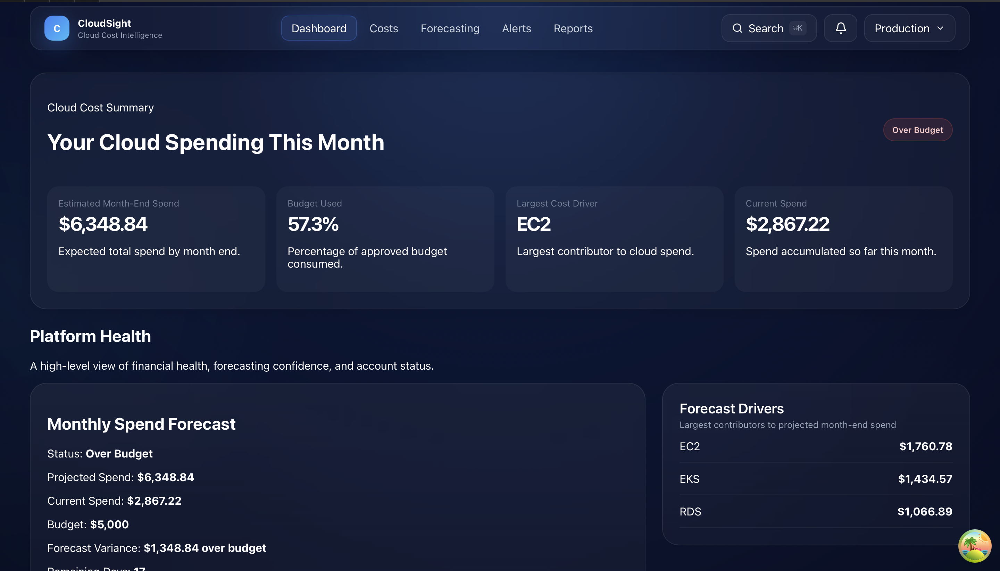
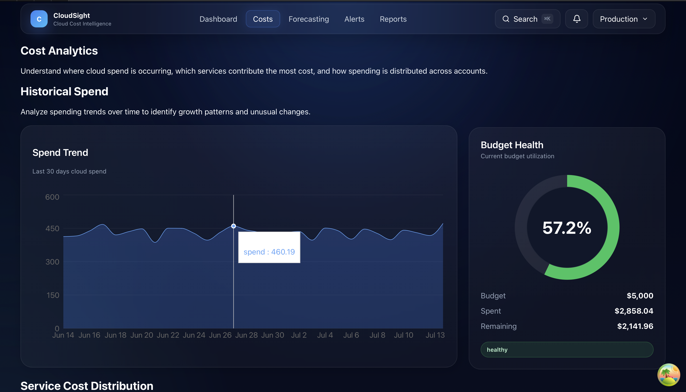
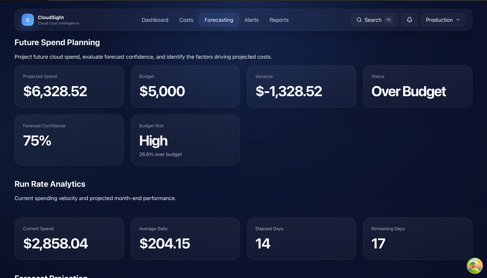
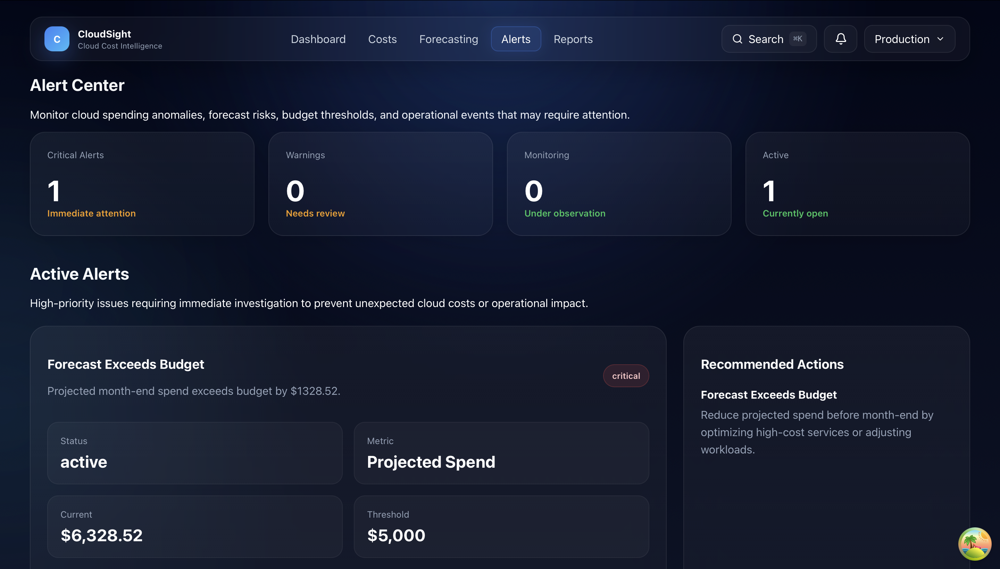
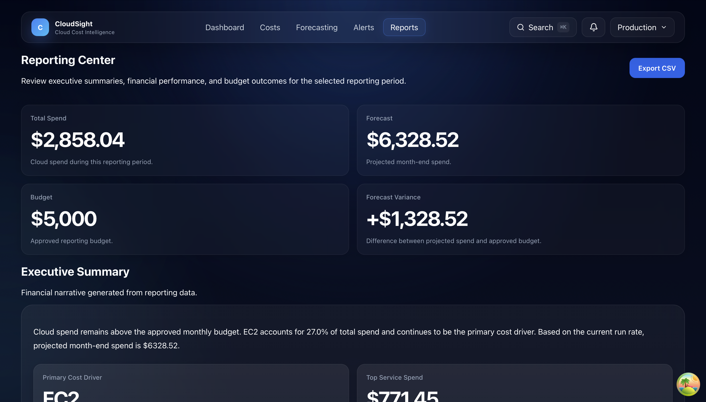

# CloudSight

<p align="center">
  
</p>

<h1 align="center">CloudSight</h1>

<h3 align="center">
Enterprise Cloud Cost Intelligence Platform
</h3>

<p align="center">
CloudSight is a production-grade full-stack FinOps platform that demonstrates modern cloud engineering, infrastructure automation, DevOps, and software architecture practices.
</p>

<p align="center">

React • TypeScript • Express • PostgreSQL • Prisma • Docker • Terraform • AWS • GitHub Actions

</p>

---

# Executive Overview

CloudSight is an enterprise-inspired Software-as-a-Service platform built to model how modern engineering organizations monitor, analyze, forecast, and optimize cloud infrastructure costs.

Unlike a traditional portfolio application, CloudSight emphasizes production engineering practices across the entire software delivery lifecycle.

The repository demonstrates:

- Enterprise Infrastructure as Code
- Production Docker Architecture
- CI/CD Automation
- Infrastructure Validation
- Operational Runbooks
- Deployment Automation
- Disaster Recovery Planning
- Cloud Engineering Best Practices
- Repository Governance
- Production Readiness

The project is intentionally developed without AWS credentials during the infrastructure construction phases.

Infrastructure is validated locally using Terraform validation mode until AWS bootstrap begins in Phase 11.

---

# Design Goals

CloudSight is designed around five engineering principles.

## Reliability

Infrastructure should be repeatable, deterministic, and resilient.

## Maintainability

Every component should be modular, loosely coupled, and easy to evolve.

## Security

Infrastructure should follow least-privilege principles and modern security practices.

## Operational Excellence

Deployments, validation, rollback, monitoring, and recovery should be documented and automated.

## Developer Experience

The repository should be simple to understand, easy to validate, and straightforward to contribute to.

---

# Current Project Status

Version

**v2.1.0-alpha**

Current Phase

**Phase 10.7A — Repository Operational Excellence**

Overall Progress

**99.8%**

Current Focus

- Production Readiness
- Operational Excellence
- Repository Consolidation
- Documentation
- AWS Bootstrap Preparation

---

# Highlights

## Enterprise Infrastructure

- Modular Terraform Architecture
- Multi-Environment Configuration
- Cloud-Init Templates
- Infrastructure Modules
- Backend Configuration Templates

## Deployment

- Production Docker Images
- Deployment Automation
- Rollback Framework
- Deployment Metadata
- Deployment History
- Pre-flight Validation

## CI/CD

- GitHub Actions
- Docker Validation
- Terraform Validation
- Security Scanning
- Smoke Testing
- Container Publishing
- Release Automation

## Documentation

- Architecture Guides
- Infrastructure Documentation
- Operational Runbooks
- Disaster Recovery
- Environment Promotion
- Production Readiness Checklist

---

# Enterprise Features

CloudSight is organized around production-ready engineering capabilities rather than isolated features.

## FinOps Platform

- Executive Dashboard
- Cloud Cost Analytics
- Budget Management
- Forecasting Engine
- Cost Optimization Recommendations
- Executive Reporting
- Alerting Framework
- Historical Trend Analysis

---

## Infrastructure Engineering

- Enterprise Terraform Architecture
- Modular Infrastructure as Code
- Multi-Environment Configuration
- Infrastructure Validation
- Cloud-Init Bootstrap Templates
- Backend Configuration Templates

---

## DevOps

- Multi-stage Docker Images
- Production Docker Compose
- GitHub Actions CI/CD
- GitHub Container Registry Publishing
- Deployment Automation
- Rollback Automation
- Pre-flight Deployment Validation
- Smoke Testing
- Health Verification

---

## Operational Excellence

- Operations Runbooks
- Disaster Recovery Procedures
- Environment Promotion Guide
- Production Readiness Checklist
- Deployment History
- Deployment Metadata
- Repository Governance

---

# Repository Architecture

```text
CloudSight
│
├── client/                     React Frontend
│
├── server/                     Express API
│
├── terraform/                  Enterprise Infrastructure
│   ├── modules/
│   ├── environments/
│   ├── templates/
│   └── cloud-init/
│
├── scripts/                    Operational Automation
│
├── deployment/                 Deployment Metadata
│
├── docs/
│   ├── architecture/
│   ├── infrastructure/
│   ├── runbooks/
│   ├── requirements/
│   ├── api/
│   ├── database/
│   └── project/
│
├── .github/
│   └── workflows/
│
├── Makefile
│
├── README.md
│
└── current.state.md
```

---

# High-Level System Architecture

```text
                    GitHub
                       │
                       ▼
              GitHub Actions CI/CD
                       │
                       ▼
          GitHub Container Registry
                       │
                       ▼
            Deployment Automation
                       │
                       ▼
             Docker Compose Stack
                       │
        ┌──────────────┼──────────────┐
        ▼              ▼              ▼
   React Client    Express API    PostgreSQL
                       │
                       ▼
                 Prisma ORM
                       │
                       ▼
              CloudSight Database
```

---

# Infrastructure Architecture

CloudSight follows a modular Infrastructure-as-Code architecture.

```text
terraform/

├── providers.tf
├── versions.tf
├── variables.tf
├── outputs.tf
├── locals.tf
├── main.tf
│
├── network.tf
├── security.tf
├── iam.tf
├── compute.tf
├── database.tf
├── load_balancer.tf
├── autoscaling.tf
├── monitoring.tf
├── sns.tf
├── acm.tf
├── route53.tf
├── backend.tf
│
├── modules/
│   ├── network/
│   ├── security/
│   ├── iam/
│   ├── compute/
│   ├── database/
│   ├── load_balancer/
│   ├── autoscaling/
│   ├── monitoring/
│   ├── sns/
│   ├── acm/
│   └── route53/
│
├── environments/
│   ├── dev/
│   ├── staging/
│   └── prod/
│
├── templates/
└── cloud-init/
```

---

# Deployment Architecture

CloudSight uses a production deployment pipeline built around immutable container images.

```text
Developer

        │

        ▼

GitHub Repository

        │

        ▼

GitHub Actions

        │

        ▼

Docker Build

        │

        ▼

GitHub Container Registry

        │

        ▼

Deployment Server

        │

        ▼

scripts/preflight.sh

        │

        ▼

scripts/deploy.sh

        │

        ▼

Docker Compose

        │

        ▼

Health Checks

        │

        ▼

Deployment Verification

        │

        ▼

Deployment History

        │

        ▼

Production Ready
```

---

# Operational Architecture

Every deployment follows the same deterministic workflow.

```text
Pre-flight Validation

        │

        ▼

Image Pull

        │

        ▼

Container Startup

        │

        ▼

Container Health Checks

        │

        ▼

Application Verification

        │

        ▼

Deployment Metadata

        │

        ▼

Deployment History

        │

        ▼

Rollback Available
```

---


# Technology Stack

CloudSight combines modern application development with enterprise cloud engineering practices.

---

## Frontend

| Technology | Purpose |
|------------|---------|
| React 19 | User Interface |
| TypeScript | Type Safety |
| Vite | Development & Build Tool |
| React Router | Client Routing |
| Recharts | Analytics Visualization |
| Framer Motion | UI Animation |
| CSS | Styling |

---

## Backend

| Technology | Purpose |
|------------|---------|
| Node.js | Runtime |
| Express | REST API |
| TypeScript | Type Safety |
| Prisma ORM | Database Access |
| PostgreSQL | Relational Database |
| Zod | Runtime Validation |

---

## Infrastructure

| Technology | Purpose |
|------------|---------|
| Terraform | Infrastructure as Code |
| AWS | Cloud Platform |
| Docker | Containerization |
| Docker Compose | Local & Production Orchestration |
| Cloud-Init | Instance Bootstrap |

---

## DevOps

| Technology | Purpose |
|------------|---------|
| GitHub Actions | CI/CD |
| GitHub Container Registry | Container Images |
| Checkov | Security Scanning |
| TFLint | Terraform Linting |
| Git | Version Control |

---

# Engineering Principles

CloudSight follows enterprise engineering practices throughout the repository.

## Infrastructure as Code

Infrastructure is modular, repeatable, and validated locally before deployment.

---

## Automation First

Every repeatable process should be automated.

Examples include:

- Deployment
- Rollback
- Health Verification
- Deployment Verification
- Terraform Validation
- Smoke Testing

---

## Operational Excellence

Infrastructure should be easy to deploy, monitor, recover, and maintain.

Operational assets include:

- Deployment Runbooks
- Disaster Recovery Procedures
- Environment Promotion
- Production Readiness Checklist

---

## Security

Security is incorporated throughout the development lifecycle.

Practices include:

- Least Privilege IAM
- HTTPS
- Security Scanning
- Immutable Container Images
- Environment Variables
- Repository Governance

---

# Local Development

## Clone Repository

```bash
git clone git@github.com:nathanlouissaint/CloudSight.git

cd CloudSight
```

---

## Install Dependencies

```bash
npm install
```

---

## Start Local Development

```bash
docker compose up --build
```

Or start services individually.

Frontend

```bash
cd client

npm install

npm run dev
```

Backend

```bash
cd server

npm install

npm run dev
```

---

# Docker Development

CloudSight ships with both development and production Docker environments.

Development

```bash
docker compose up --build
```

Production Validation

```bash
docker compose -f docker-compose.prod.yml up --build
```

Deployment

```bash
docker compose -f docker-compose.deploy.yml up -d
```

---

# Terraform Development

CloudSight intentionally supports infrastructure development without AWS credentials.

Validation workflow:

```bash
terraform -chdir=terraform fmt -recursive

terraform -chdir=terraform init -backend=false

terraform -chdir=terraform validate
```

During Phase 10, infrastructure is validated locally only.

The following commands are intentionally deferred until Phase 12:

- terraform plan
- terraform apply

---

# Development Workflow

Feature Development

↓

Repository Verification

↓

Docker Validation

↓

Terraform Validation

↓

Security Validation

↓

Smoke Tests

↓

GitHub Actions

↓

Container Publishing

↓

Deployment Validation

↓

Production Ready

---

# Validation Workflow

CloudSight validates every layer of the platform.

Repository

```bash
make verify
```

Terraform

```bash
make terraform
```

Docker

```bash
make docker
```

Documentation

```bash
make docs
```

Smoke Tests

```bash
make smoke
```

Security

GitHub Actions executes:

- Checkov
- TFLint
- Workflow Validation

---

# Makefile Commands

| Command | Purpose |
|----------|---------|
| make help | Display available commands |
| make verify | Repository verification |
| make terraform | Terraform validation |
| make docker | Docker validation |
| make security | Security validation |
| make smoke | Production smoke tests |
| make deploy | Deployment automation |
| make rollback | Rollback automation |
| make docs | Documentation validation |
| make clean | Cleanup temporary resources |

---


---

# CI/CD Pipeline

CloudSight implements a multi-stage continuous integration and delivery pipeline designed around validation, repeatability, and deployment safety.

## Repository Validation

Every change is validated before deployment through automated workflows.

Pipeline stages include:

- Repository Verification
- Type Checking
- Application Build
- Docker Validation
- Terraform Validation
- Security Scanning
- Smoke Testing
- Release Automation

---

## GitHub Actions Workflows

| Workflow | Purpose |
|----------|---------|
| verify.yml | Repository Verification |
| docker.yml | Docker Validation |
| terraform.yml | Infrastructure Validation |
| security.yml | Security Checks |
| smoke.yml | Production Smoke Tests |
| publish.yml | Publish Images to GHCR |
| deploy.yml | Deployment Automation |
| release.yml | Release Management |

---

## Deployment Flow

```text
Developer

    │

    ▼

Git Push

    │

    ▼

Repository Verification

    │

    ▼

Terraform Validation

    │

    ▼

Docker Build

    │

    ▼

Security Validation

    │

    ▼

Smoke Tests

    │

    ▼

Publish Images

    │

    ▼

Production Deployment
```

---

# Operational Documentation

CloudSight includes operational documentation intended to support production deployment and long-term maintenance.

| Document | Purpose |
|----------|---------|
| Deployment Runbook | Production deployment procedures |
| Operations Runbook | Operational maintenance |
| Disaster Recovery | Incident recovery process |
| Environment Promotion | Promotion between environments |
| Production Readiness Checklist | Final production verification |
| Server Setup Guide | Infrastructure bootstrap |

---

# Repository Standards

The repository follows enterprise engineering standards.

## Infrastructure

- Infrastructure as Code
- Modular Terraform Architecture
- Environment Isolation
- Reusable Modules

---

## Software Engineering

- Type Safety
- Layered Architecture
- RESTful APIs
- Repository Pattern
- Service Layer
- Contract Validation

---

## DevOps

- Automated Validation
- Immutable Deployments
- Health Monitoring
- Rollback Procedures
- Deployment Metadata
- Deployment History

---

## Documentation

Documentation is maintained alongside implementation.

Major documentation categories include:

- Architecture
- Infrastructure
- Requirements
- Database
- API
- Runbooks
- Repository Governance

---

# Project Roadmap

## Completed

- Executive Dashboard
- Full-stack Application
- Production Docker Architecture
- Enterprise Terraform Architecture
- Infrastructure Modules
- GitHub Actions Automation
- Deployment Framework
- Operational Runbooks
- Disaster Recovery Planning
- Repository Governance

---

## Current Phase

**Phase 10.7B — Repository Consolidation**

Current objectives:

- Enterprise README
- Repository Documentation
- Root current.state.md
- Documentation Validation
- Production Readiness Preparation

---

## Upcoming

### Phase 10.8

Production Readiness Review

- Repository Audit
- Documentation Audit
- Infrastructure Review
- Deployment Validation
- Release Readiness

---

### Phase 11

AWS Bootstrap

- AWS Account Integration
- Remote Terraform Backend
- State Storage
- IAM Provisioning
- Initial Infrastructure Deployment

---

### Phase 12

Production Infrastructure

- terraform plan
- terraform apply
- DNS Configuration
- TLS Certificates
- Monitoring
- Production Operations

---

# License

This project is licensed under the MIT License.

See the LICENSE file for additional information.

---

# Closing Summary

CloudSight demonstrates how a modern cloud-native SaaS platform can be engineered using enterprise software development practices.

The repository emphasizes maintainability, infrastructure automation, operational excellence, and production engineering over isolated application features.

Although the infrastructure is currently validated using offline Terraform workflows, the project has been intentionally structured to transition directly into AWS bootstrap with minimal architectural change.

CloudSight is approaching production readiness and will next transition into comprehensive production review before live cloud deployment.

## Product Walkthrough

CloudSight provides engineering leaders and FinOps teams with a centralized view of cloud spend, forecasting, operational risk, and executive reporting.

### Dashboard

The executive dashboard summarizes monthly cloud spending, budget utilization, forecasted costs, and the largest cost drivers.

<p align="center">
  
</p>
---

### Cost Analytics

Analyze historical spending trends, budget health, and service-level cost distribution to understand where cloud spend is occurring.

<p align="center">
  
</p>

---

### Forecasting

Project month-end cloud spend using historical usage patterns, confidence scoring, and budget risk analysis.

<p align="center">
  
</p>

---

### Alert Center

Detect budget overruns, spending anomalies, and operational risks with actionable recommendations.

<p align="center">
  
</p>

---

### Executive Reporting

Generate executive summaries, export financial reports, and review cloud spending performance across reporting periods.

<p align="center">
  
</p>